# About Inherit Logic

Currently, Inherit Logic is composed of two modules, Cricket and MendelPede. We are unable to have a live demo available at the moment, so the following is the help pages to give you an idea of how the modules work.

## Cricket

### Getting Started
When you click on your first scenario, you are greeted with a general overview
of the task you need to complete. To begin working, click “Lab.”

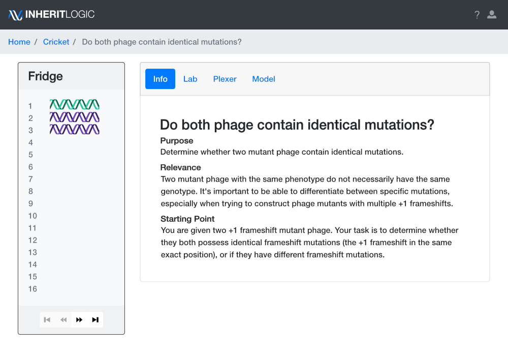

### Fridge

Purple-colored and green-colored phage strains in the fridge are provided at the beginning of each scenario.

Green-colored phage are reference strains where the genotype is known.

Purple-colored phage have unknown genotype. It is often the task of the scenario.

Black-colored phage and orange-colored phage are user-generated strains.

Clicking on the “…” symbol next to the strain allows you to gain more information about the strain.

If the scenario wants you to generate a strain with specific properties, you can mark "Submitted" on User strains so the instructor knows this is the strain you want graded.

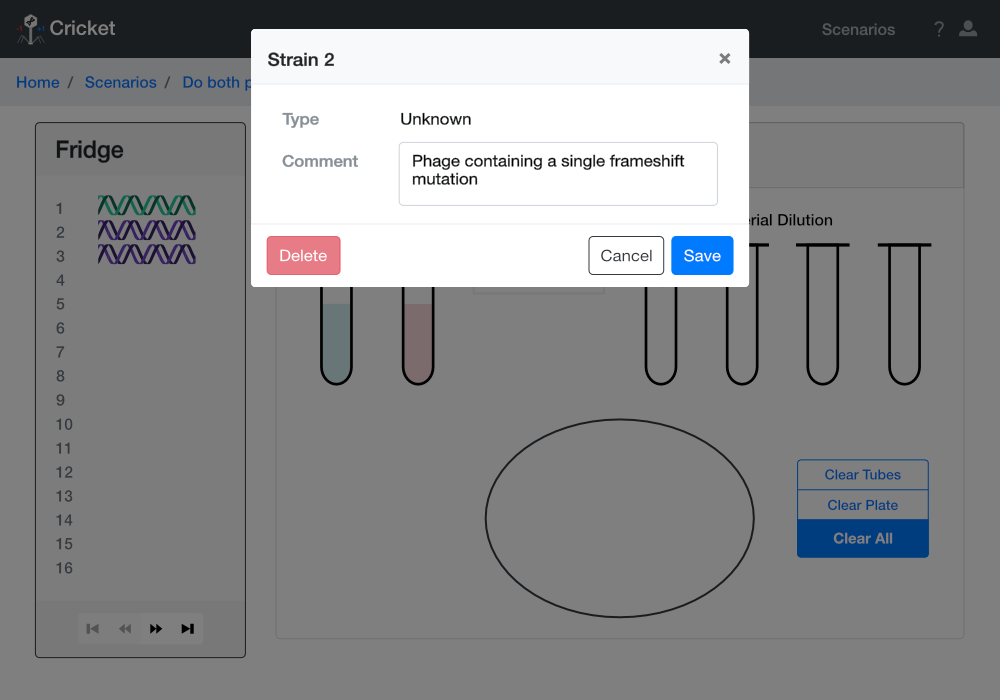

### B and K strain *E. coli*

In the lab room, there are B and K strain *E. coli* provided for your experiments.

Understanding the properties of B and K strain *E. coli* will help you to choose the best strain for your particular experiment.

**B strain**: When this strain of *E. coli* is plated with wildtype phage, the wildtype phage will produce small plaques on the plate. When B strain is plated with mutant phage, the phage will produce large plaques.

**K strain**: When this strain of *E. coli* is plated with wildtype phage, the wildtype phage will produce small plaques on the plate. Mutant phage do not produce any plqaues on this strain.

**What is a plaque?** A plaque is a circular clearing of bacterial growth on the plate. Imagine that when we plate E. coli, the bacterial growth forms a lawn on the plate that fills the entire plate. Plaques occur when phage attack and kill E. coli, resulting in these circular clearings.

### Plating a Phage Strain

To plate a strain of phage, first click your chosen phage strain in the fridge then click the test tube containing the *E. coli* strain of your choice.

Here, we have incubated Phage Strain 1 with K strain *E. coli*.

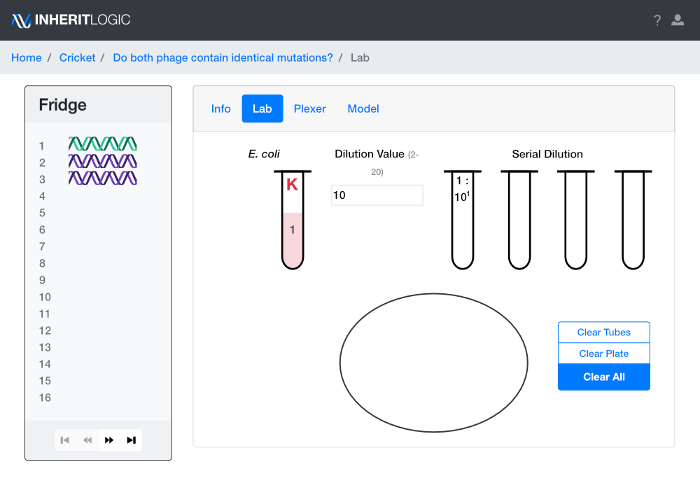

Next, click the *E. coli* test tube then click the 1:101 serial dilution tube. This will create a dilution of your *E. coli* culture.

The dilution you should choose depends on the question you are trying to investigate.

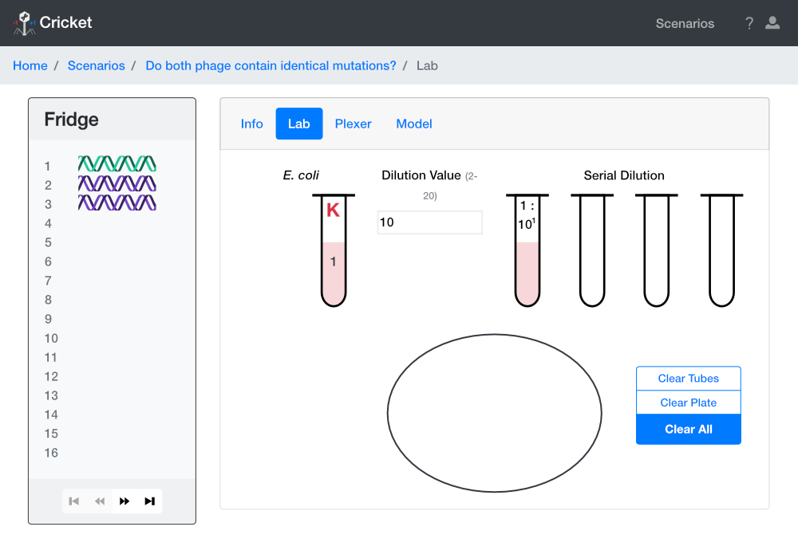

To further dilute your sample, you can click the 1:101 serial dilution then click the adjacent tube to create a 1:102 dilution.

You can make serial dilutions up to 1:104.

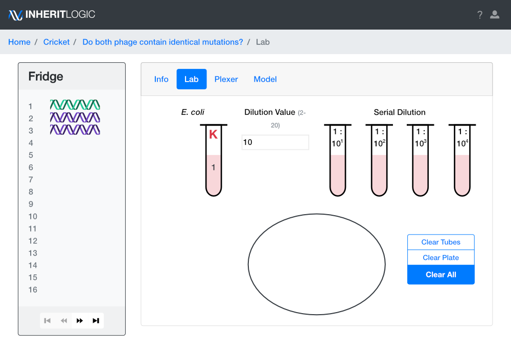

To plate your sample, click the dilution of your choice then click the plate. Here, we will plate the 1:104 dilution.

This is our plating result. On the plate, we see 100 small plaques and 0 large plaques.

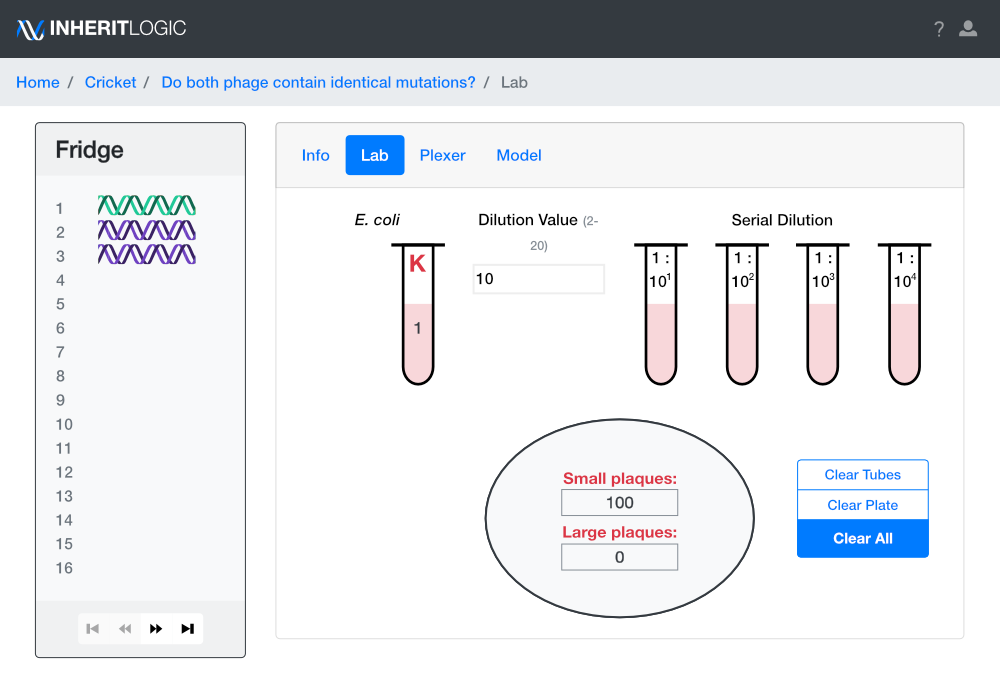

### Storing a Phage Strain

If you wish to store a phage strain from the plate, simply click the number corresponding with the plaque size you wish to store then click on an empty spot in the fridge.

The newly stored phage strain is black in color.

Note that if you need more storage in the fridge, there are arrow buttons at the bottom of fridge that will provide more space for storing phage.

### Crossing Phage

If you wish to cross to phage strains together, click then drop both strains separately into the *E. coli* strain of your choice.

You will see both phage incubating in the test tube. You can then make serial dilutions and plate them to observe the results of the cross.

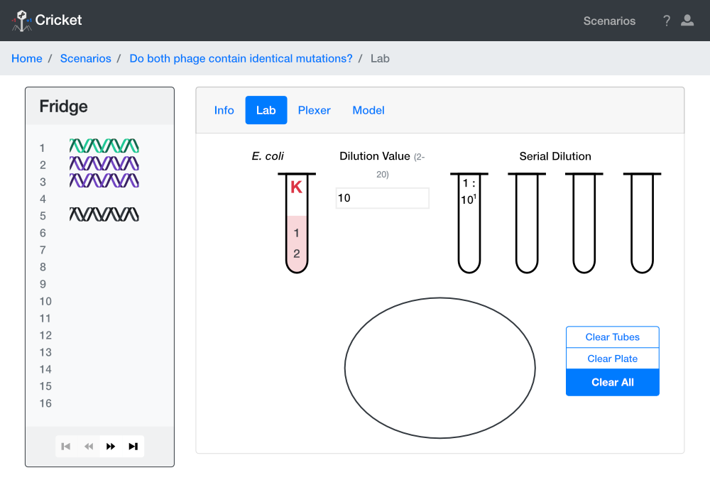

### Plexer

The Plexer is useful for crossing a large number of phage strains at the same time.

To use the Plexer, click the phage you want to cross and drop it into the boxes in the first row or column. Then, select which *E. coli* strain you would like to use. If you desire, you can change the dilution value. Then, press submit.

The results will appear beneath your phage strain and will look similar to the results we see from plates in the main lab room. You are unable to store phage strains produced from the Plexer in the fridge.

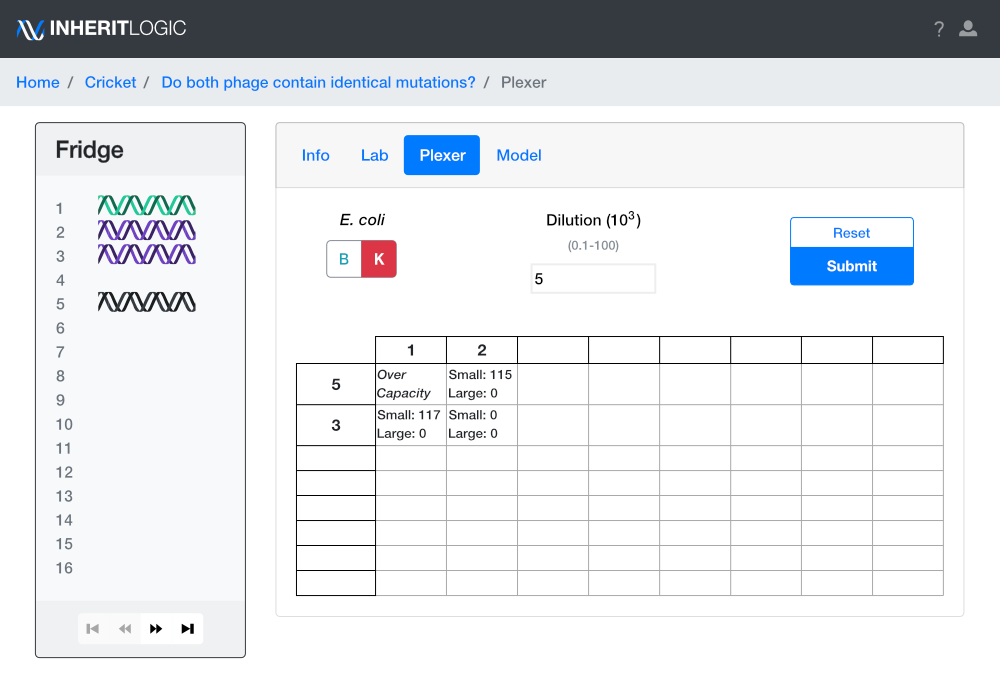

### Model

One scenario requires modeling large gene deletions in the phage. This is done in the Model Room.

All Unknown strains will have a line with boxes. Each box represents 10 bp. Click boxes to mark where the deletion occurs in that strain. You can see the coordinates by hovering over the box.

## MendelPede

### Getting Started

When you click on the first scenario “All Mendel,” it opens up the Lab Room.

You are given 6 Pedes when you start each scenario.

The Pedes in your Lab Room will display **three** different traits. Each trait will have two different phenotypes (for example, Eye Color could have purple and green phenotypes).
The possible traits are:
- Eye Color
- Segment Color
- Dot Color
- Number of Segments
- Number of Legs

### Crossing Pedes

To cross two Pedes together to generate progeny, click on one male and one female Pede located in your fridge.

The Pedes you select then appear in the Lab Room. If you click the wrong Pede, click "Clear" to restart the cross.

In the middle square, you will see the progeny that was generated from the cross.

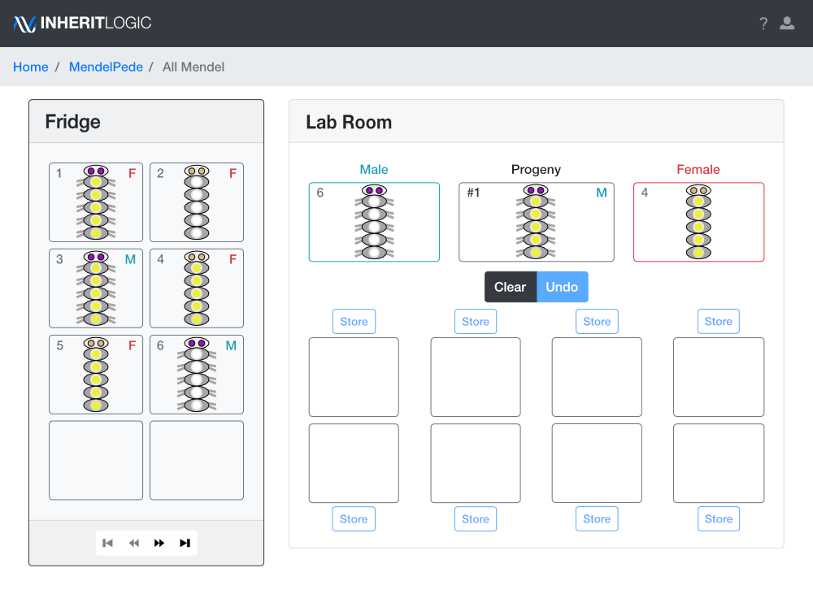

### Sorting Pedes

You may sort progeny into the 8 bins located below the parents of the cross.

Clicking on one of the bins will move the Pede from the “Progeny” area to the desired bin. You can also use the keyboard numbers 1 through 8 to sort.

When using MendelPede, it’s usually most helpful to sort your progeny into a small number of bins, as shown here.

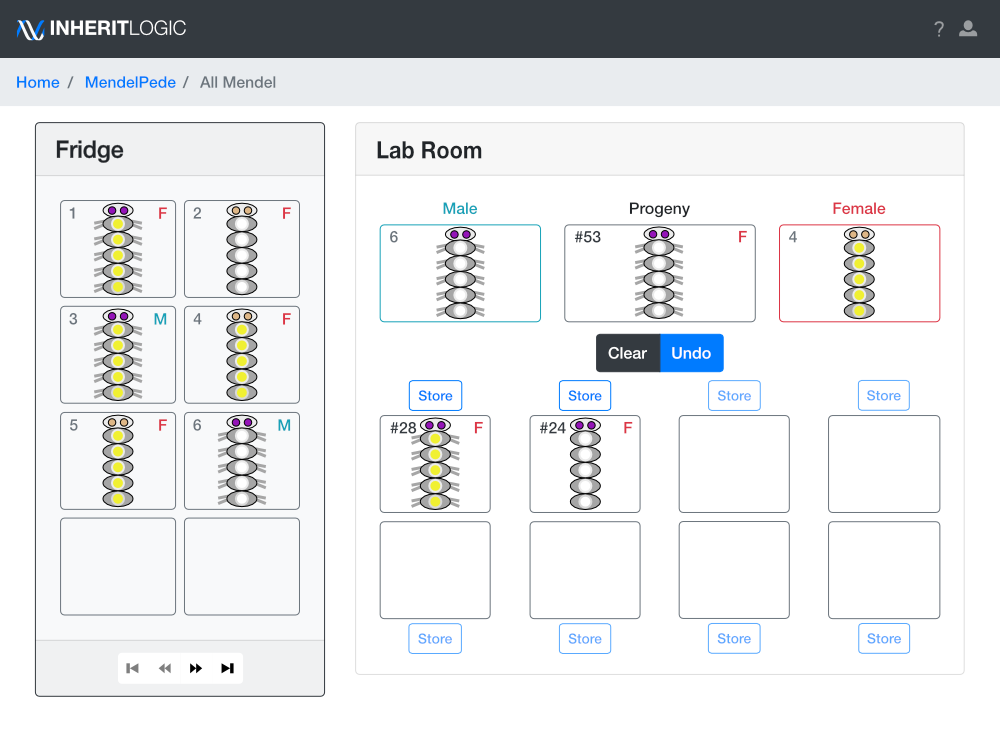

If you accidentally sort a Pede into the wrong bin, click the “Undo” button to reverse the sorting.

If you are finished crossing the two parents together, click “Clear” to clean out your lab room so that you can perform a different cross.

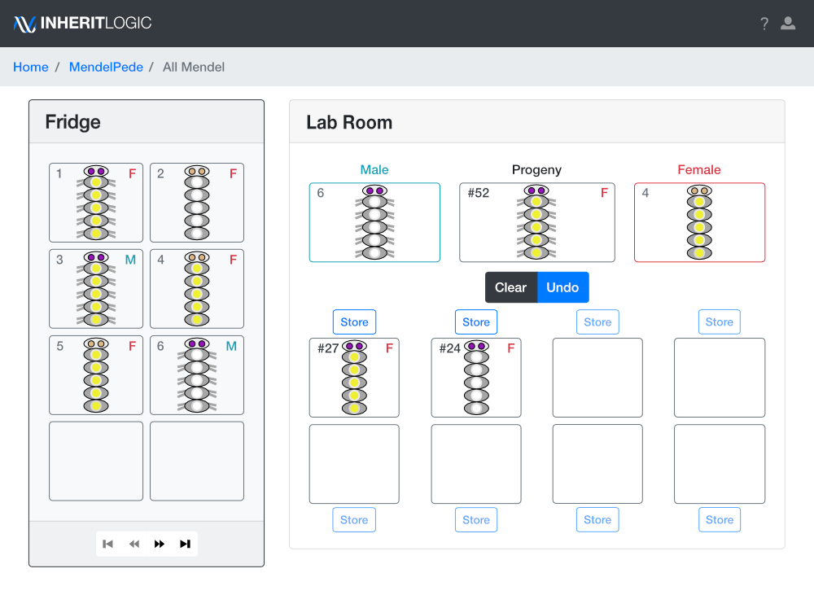

### Storing Pedes

It is also possible to store progeny in your fridge. To do this, click the “Store” button located above the individual you would like to save.

If necessary, you may also delete your stored progeny by clicking the trashcan icon located in the Pede’s box in the Fridge.

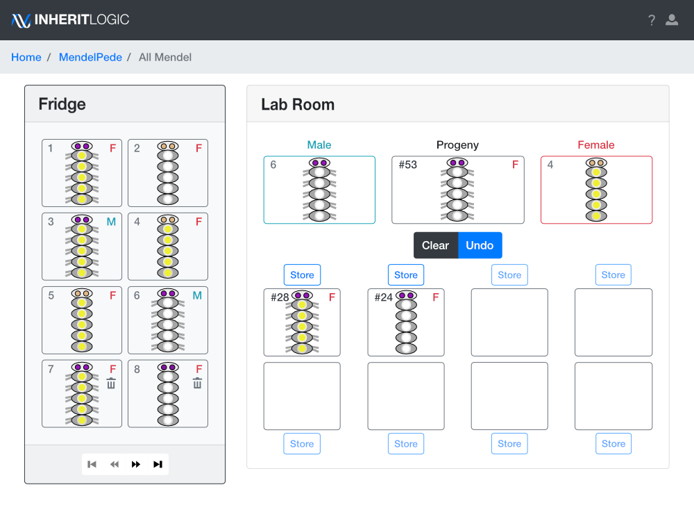

As you store progeny, you may run out of room on the first shelf.
Click on the right arrow located at the bottom of the fridge to view additional shelves.

The pede will be stored after *last* strain in the fridge, even if there are empty spots before. For example, if pedes are in spots 8, 9, 13, and 14, the next stored pede will go to spot **15**.

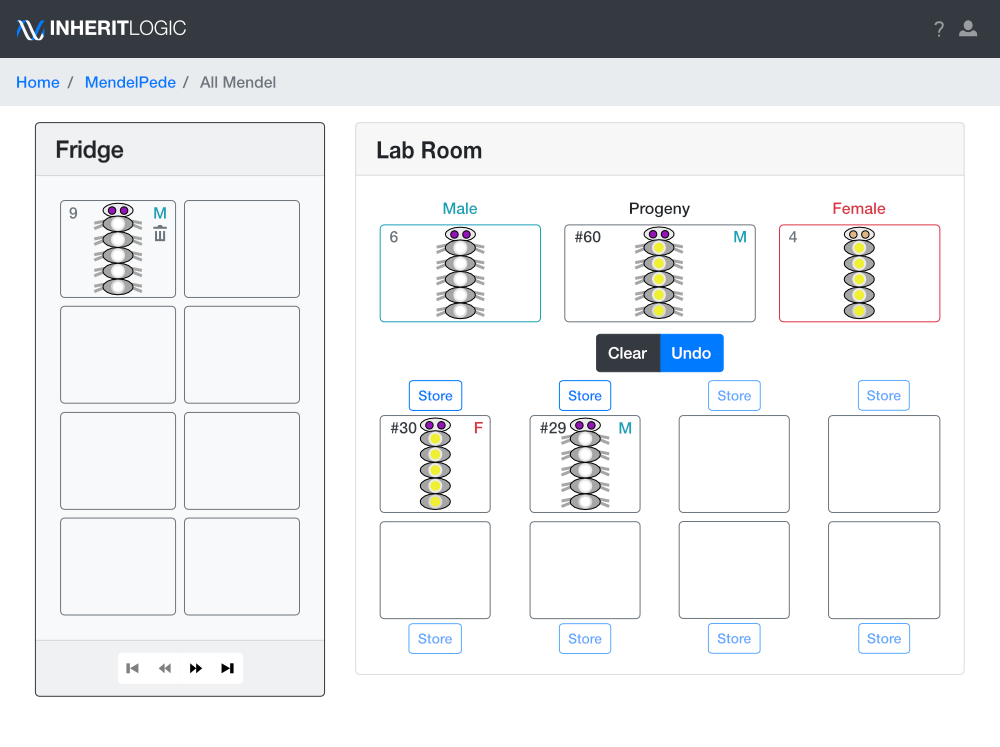
