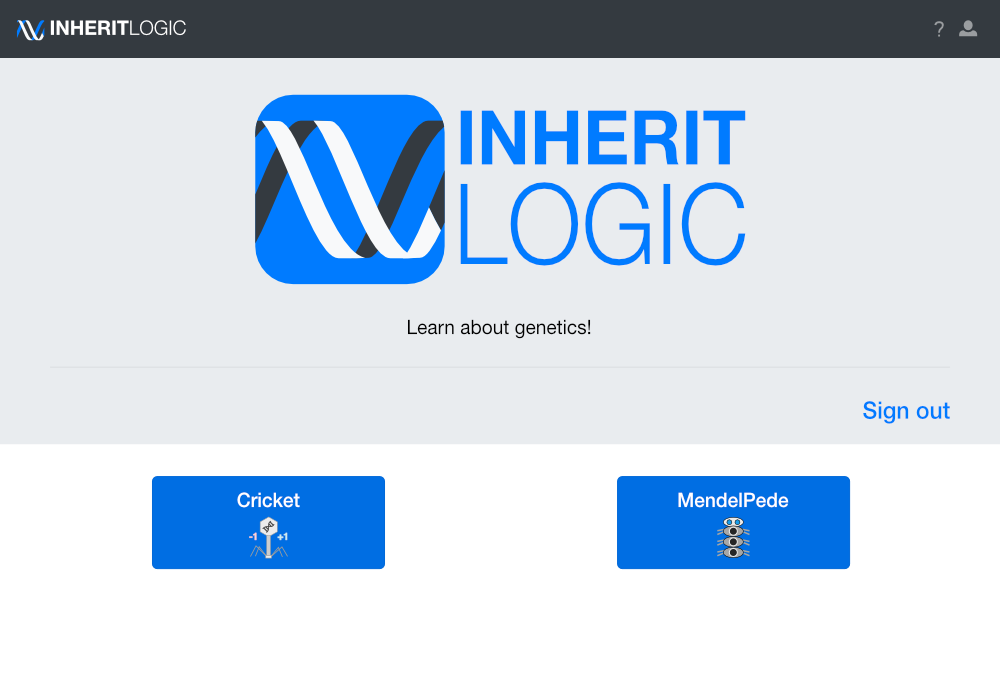
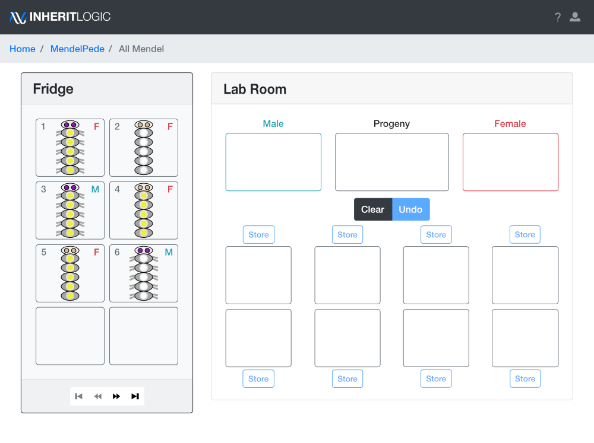

# Inherit logic

Inherit Logic is a web based application aimed to teach students about different
concepts in genetics. Currently, it has two modules: Cricket, which focuses on
frameshift mutations, and MendelPede, which focuses on types of transmission genetics.
Both modules allow students to perform virtual experiments and actively learn
the concepts through problem-solving.

**Demo coming soon. For a walk-through of the app, see [about](ABOUT.md).**

## Cricket

Follow the footsteps of Crick *et al.* as they deduce the 3-letter nature of the code

Using *E. coli* and bacteriophage, students explore frameshift mutations in phage
strains. Initially, they work to determine which of two strains has a mutation
and work through more complex scenarios such as generating phage with specific mutations.

Set up to mirror a real lab experience, students incubate phage, apply serial dilutions,
plate in dishes, and extract colonies for further examination.

## MendelPede

Determine different inheritance modes by choosing crosses and analyzing offspring phenotypes and ratios

Similar to crossing fruit flies, students cross "pedes" with various traits. They to
determine the mode of inheritance and allele dominance. There are scenarios with Mendelian inheritance,
non-Mendelian inheritance, and unknown inheritance that the students must identify.
Students can sort offspring by trait to calculate ratios and store offspring for
future experiments.

Additionally, there are quizzes where students must determine the genotype of the
provided pedes.

All the genetics problem solving of fruit fly crosses without
having to wait for them to hatch!

## Installation

Interested in using Inherit Logic in your own class or simply want to explore the software?
Follow the [installation](INSTALL.md) instructions.

Instructions are written to install on a unix-based server or to run locally. The app
follows the MEAN framework (MongoDB, Express.js, Angular, and Node.js), so it should work
anywhere those technologies are compatible.
